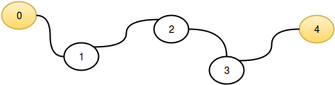

# Flatland Space Stations

Flatland is a country with a number of cities, some of which have space stations. 
Cities are numbered consecutively and each has a road of **1 km** length connecting it to the next city. 
It is not a circular route, so the first city doesn't connect with the last city. 
Determine the maximum distance from any city to its nearest space station.

>**Example**

n = 3

c = [1]

There are n = 3 cities and city  has a space station. 
They occur consecutively along a route. 
City **0** is **1 - 0 = 1** unit away and city **2 - 1 = 1** is  units away. 
City **1** is **0** units from its nearest space station as one is located there. 
The maximum distance is **1**.

>**Function Description**

Complete the flatlandSpaceStations function in the editor below.

flatlandSpaceStations has the following parameter(s):

- int n: the number of cities

- int c[m]: the indices of cities with a space station

>**Returns**

- int: the maximum distance any city is from a space station


>**Input Format**
- The first line consists of two space-separated integers, **n** and **m**.

  The second line contains **m** space-separated integers, the indices of each city that has a space-station. These values are unordered and distinct.

> **Sample Input 0**
```java
	STDIN   Function
        -----   --------
        5 2     n = 5, c[] size m = 2
        0 4     c = [0, 4]
```


> **Sample Output 0**
>
> 2

> **Explanation 0**
> 
>This sample corresponds to following graphic:
> 
>
> 
> The distance to the nearest space station for each city is listed below:
> 
>* **c[0]** has distance **0 km**, as it contains a space station.
> 
>* **c[1]** has distance **1 km** to the space station in .
> 
>* **c[2]** has distance **2 km** to the space stations in  and .
> 
>* **c[3]** has distance **1 km** to the space station in .
> 
>* **c[4]** has distance **0 km**, as it contains a space station.
>
> We then take max(0,1,2,1,0).

> **Sample Imput 1**
>
> 6 6
> 
> 0 1 2 4 3 5

> **Sample Output 1**
>
> 0

> **Explanation 1**
>
> In this sample, **n = m** so every city has space station and we print **0** as our answer.


