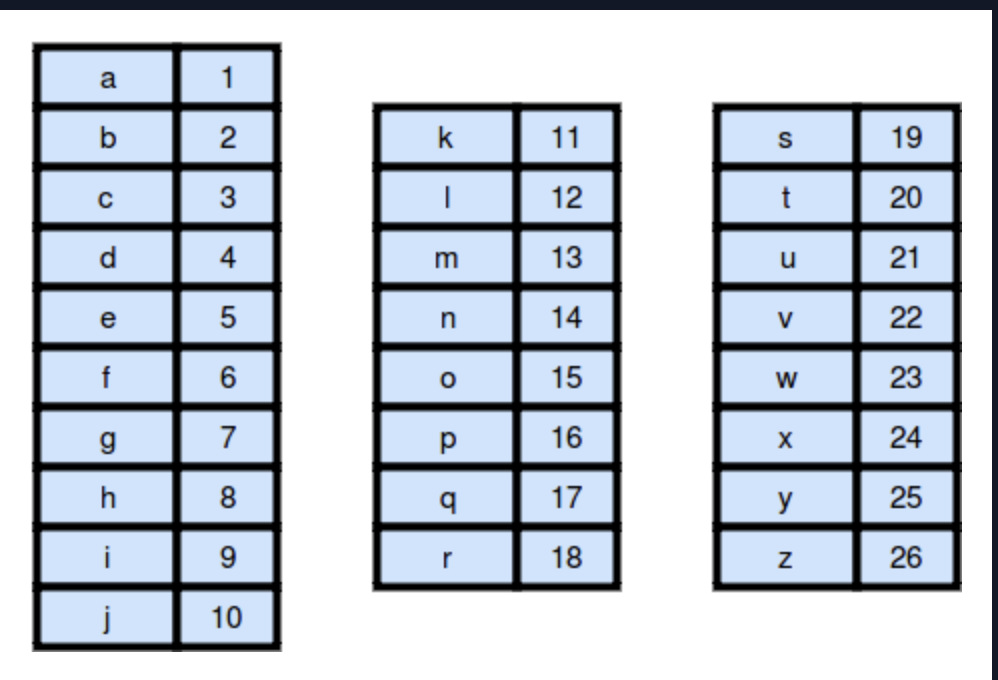
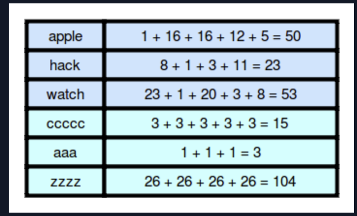
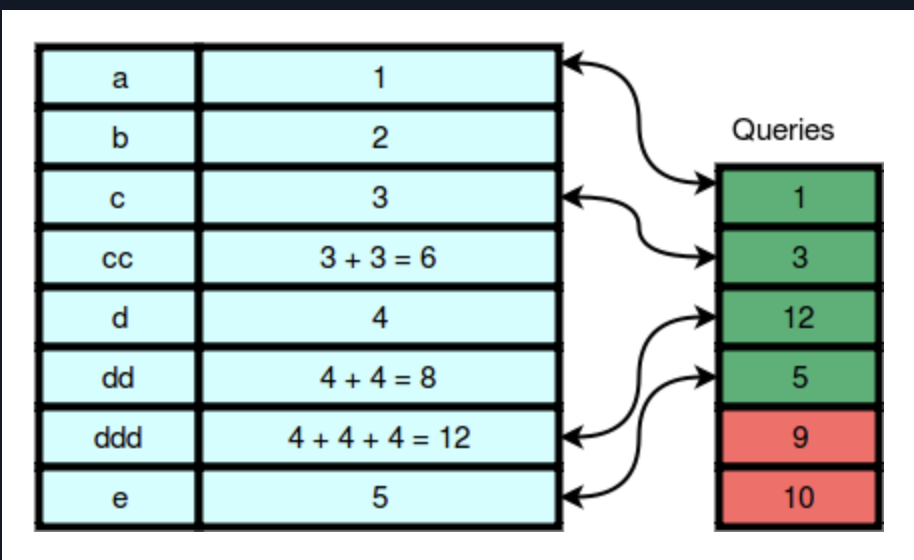

# Weighted Uniform Strings

A weighted string is a string of lowercase English letters 
where each letter has a weight. Character weights 
are **1** to **26** from **a** to **z** as shown below:



- The weight of a string is the sum of the weights of its characters. For example:



- A uniform string consists of a single character repeated zero or 
more times. For example, ccc and a are uniform strings, 
but bcb and cd are not.

Given a string, **s**, let ***U*** be the set of weights for all possible 
uniform contiguous substrings of string *s*. There will be **n** queries to 
answer where each query consists of a single integer. 
Create a return array where for each query, the value is Yes if **query[i] &isin; U**. 
Otherwise, append No.

**Note:** &isin; The  symbol denotes that **x[i]** is an element of set ***U***.

>**Example**

**s = 'abbcccdddd'**

**queries = [1, 7, 5, 4, 15]**

Working from left to right, weights that exist are:

```
string  weight
a       1
b       2
bb      4
c       3
cc      6
ccc     9
d       4
dd      8
ddd     12
dddd    16
```

Now for each value in **queries**, see if it exists in the 
possible string weights. The return array is 
['Yes', 'No', 'No', 'Yes', 'No'].

>**Function Description**

Complete the weightedUniformStrings function in the editor below.

weightedUniformStrings has the following parameter(s):
- string s: a string
- int queries[n]: an array of integers

>**Returns**

- string[n]: an array of strings that answer the queries

>**Input Format**

The first line contains a string **s**, the original string.
The second line contains an integer **n**, the number of queries.
Each of the next **n** lines contains an integer **queries[i]**, 
the weight of a uniform substring of **s** that may or may not exist.


> **Constraints**

- *1 &le; length of s, n &le; 10<sup>5</sup>*
- *1 &le; queries[i] &le; 10<sup>7</sup>*


> **Sample Input 0**
```
    abccddde
    6
    1
    3
    12
    5
    9
    10
```

> **Sample Output 0**
```
Yes
Yes
Yes
Yes
No
No
```

> **Explanation 0**

The weights of every possible uniform substring in the 
string abccddde are shown below:



We print Yes on the first four lines because the first four queries match weights of uniform 
substrings of **s**. We print *No* for the last two queries 
because there are no uniform substrings in **s** that have those weights.

Note that while de is a substring of **s** that would have a weight of **9**, 
it is not a uniform substring.

Note that we are only dealing with contiguous substrings. 
So ccc is not a substring of the string ccxxc.